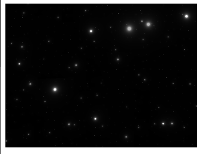
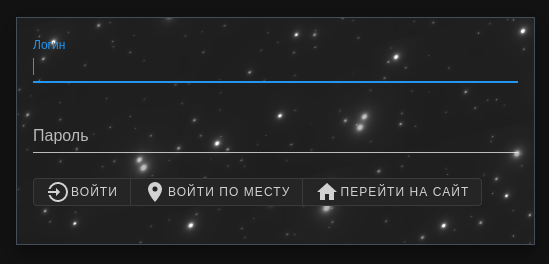

# space-shader-box

WebGL fragment shader space effect. WebComponent built with Svelte.


## How it use

Install it with npm:
```bash
$ npm install space-shader-box
```
Then import it in your code and use it in HTML as [__WebComponent__](https://developer.mozilla.org/en-US/docs/Web/Web_Components).
```js
import 'space-shader-box'
```
```html
<div class='some'>
    <space-shader-box
        width="518px"
        height="227px"
    ></space-shader-box>
</div>
```

Or, you may use it in simple static project like this:
```html
<!DOCTYPE html>
<html lang="en">
<head>
    <meta charset="UTF-8">
    <meta http-equiv="X-UA-Compatible" content="IE=edge">
    <meta name="viewport" content="width=1.0, initial-scale=1.0">
    <title>Example</title>
</head>
<body>
    <space-shader-box></space-shader-box>
    <script src="js/space-shader-box.js"></script>
</body>
</html>
```

You will have just "canvas" element with stars effect: 

You may customize it with your own styles. For example my login form: .